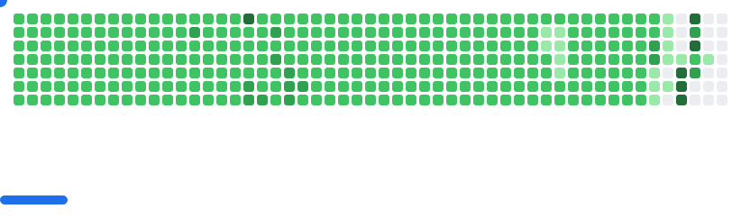

<!-- BIRTHDAY_CONFETTI --><!-- BIRTHDAY_CONFETTI --><!-- BIRTHDAY_CONFETTI --><!-- BIRTHDAY_CONFETTI --><!-- BIRTHDAY_CONFETTI --><!-- BIRTHDAY_CONFETTI --><!-- BIRTHDAY_CONFETTI --><!-- BIRTHDAY_CONFETTI --><!-- BIRTHDAY_CONFETTI --><!-- BIRTHDAY_CONFETTI -->

## 👤 Profile Views
New Count as ffrom November 14th, 2025

# ⭐ 1K FOLLOWERS ACHIEVEMENT UNLOCKED! ⭐

  

**This milestone wouldn't be possible without you! Thank You 😊❤️**

<!-- 👇 Add this right below -->

---

  
  Coding From Home!!!☕
  

  

  
  
  

  

<h1 align="center">
  Hey there 
</h1>

  
  
  

---

### 🚀 **Hello, fellow Earthlings!**
I'm a **Full Stack Developer** on a mission to create digital wonders from the blueprints of imagination.

- 🔭 By day, I wield my coding wand as a **Software Engineer**, conjuring both frontend and backend magic to craft enchanting web applications that captivate users.
- 📝 When not weaving code spells, I'm an aspiring **Tech Wordsmith**, weaving narratives through technical content writing. Explore my tales of technology on [Hashnode](https://ivgeek.hashnode.dev/).
- ⚡ Off the clock, you'll find me embarking on heroic quests at [GeeksforGeeks](https://www.geeksforgeeks.org/), delving into the mystic tomes of tech articles, and occasionally venturing into the realms of gaming.
- 🥅 **My grand quest?** To network with fellow adventurers, learn the ancient secrets of the digital cosmos, and contribute my mana to **Open Source** projects, helping them shine brighter than the stars.
- 🌌 **Join me on this cosmic journey!** Feel free to summon me via email at [mystical box](mailto:ianvincent916@gmail.com) or channel your magic through [LinkedIn](https://www.linkedin.com/in/ian-vincent-a7600a181/).

---

### 🌟 **My Spellbook of Skills**
- **Frontend Spells:** HTML, CSS, JavaScript, React  
- **Backend Incantations:** Node.js, Express, Python, Django  
- **Database Potions:** MongoDB, PostgreSQL, MySQL  
- **Tools of the Trade:** Git, VS Code, Docker  
- **Cloud Wizardry:** AWS, Azure  

---

<h2 align="center">🪄 Behold Some of My Recent Enchantments</h2>

  <table>
    <tr>
      <td width="50%">
        <h3 align="center">The Web Number Guessing Game</h3>
        

          
          

            
            
          

          
<strong>JavaScript, HTML, CSS</strong> - Welcome to the "Multiplayer Guess the Number" game! This interactive game allows users to enjoy the classic number-guessing experience in both single and multiplayer modes. Challenge your skills, intuition, and friends as you strive to guess the correct number within a limited number of attempts. Earn the highest score and have a blast in this exciting gaming adventure!

        

      </td>
      <td width="50%">
        <h3 align="center">Guess The Word Game App</h3>
        

          
          

            
            
          

          
<strong>JavaScript, HTML, CSS</strong> - This fun game has players enter letters while trying to guess the word with their 8 tries. The words are fetched from an API.

        

      </td>
    </tr>
    <tr>
      <td width="50%">
        <h3 align="center">GitHub Repo Gallery App</h3>
        

          
          

            
            
          

          
<strong>JavaScript, HTML, CSS</strong> - App pulls data from GitHub API calls to populate username, bio, location, number of public repos, and individual repo information.

        

      </td>
      <td width="50%">
        <h3 align="center">LOLcat Clock App</h3>
        

          
          

            
            
          

          
<strong>JavaScript, HTML, CSS</strong> - This app features a clock with current time and images that change with the time of day. It also has three timers and corresponding images for each.

        

      </td>
    </tr>
  </table>

---

### :hammer_and_wrench: **Languages and Tools**

  &nbsp;
  &nbsp;
  &nbsp;
  &nbsp;
  &nbsp;
  &nbsp;
  &nbsp;
  &nbsp;
  &nbsp;
  &nbsp;
  &nbsp;
  &nbsp;
  &nbsp;
  &nbsp;
  &nbsp;
  &nbsp;
  &nbsp;
  &nbsp;
  &nbsp;
  &nbsp;
  &nbsp;
  &nbsp;
  &nbsp;
  &nbsp;
  &nbsp;
  &nbsp;
  &nbsp;
  &nbsp;
  
  
  &nbsp;
  
  
  &nbsp;
  
  
  &nbsp;
  
  
  &nbsp;
  &nbsp;
  &nbsp;
  &nbsp;
  &nbsp;
  &nbsp;
  &nbsp;
  
  
  &nbsp;
  
  
  &nbsp;
  
  
  &nbsp;
  
  

---

### 🏆 **My Trophy Stats**

### 🔥 **My Stats**

### 💻 **My Languages**

  
  
  
  
  

---

### 🐍 **GitHub Contribution Snake**

---
<picture>
  <source media="(prefers-color-scheme: dark)" srcset="dist/breakout-dark.svg">
  <source media="(prefers-color-scheme: light)" srcset="dist/breakout-light.svg">
  
</picture>

---

### 🎉 **Fun Fact**
I once fixed a bug in production while skydiving! 🪂

---

### 📚 **Favorites**
- **Book:** Clean Code by Robert C. Martin
- **Tool:** VS Code
- **Podcast:** Syntax FM
- **Quote:** "Code is poetry."

---

### 😂 **Random Joke**

---

### 💡 **Programming Quotes**

---

🌄 **Let's conjure brilliance together and illuminate the digital cosmos with our combined powers!**

---

  

